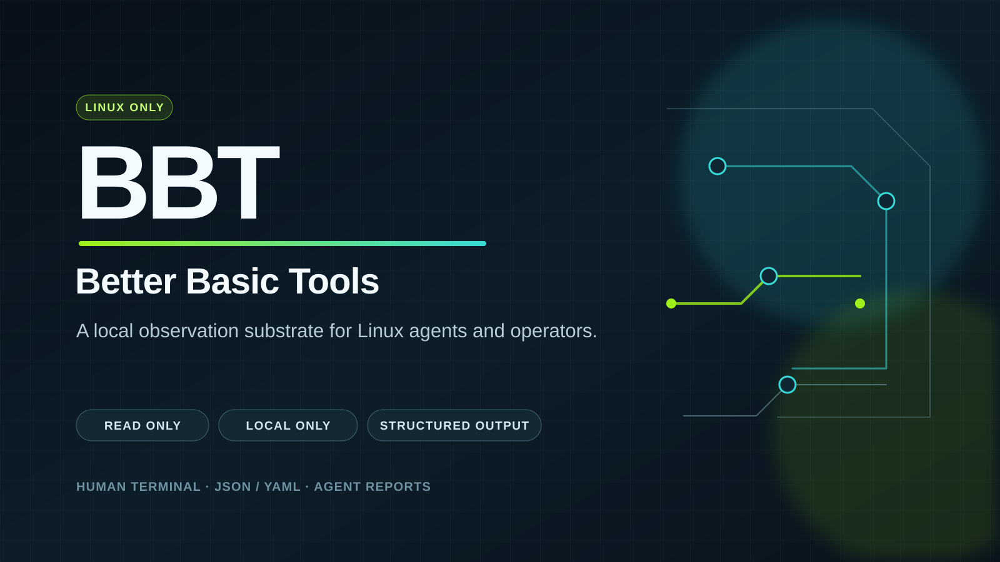

<p align="center">
  
</p>

# Better Basic Tools

**Better Basic Tools (BBT) is a local Linux observation substrate for agents and operators.**

It turns common ad hoc pipe-chains into deterministic, read-only commands that
return clear summaries, stable structured data, evidence-backed facts, and safe
next observations about Linux system state.

Short thesis:

> **BBT helps agents and operators understand Linux systems without fragile shell glue.**

Supporting phrase:

> **Structured Linux facts for agents and operators.**

## Alpha status

BBT is currently an **alpha** project. The core contract is in place: local,
read-only Linux observations with human, JSON, and agent-facing output, a full
schema set, CI quality gates, and supply-chain enforcement. Expect human wording
and some schema details to still evolve before v1.0; the schema-freeze plan is
documented in [`docs/release-policy.md`](docs/release-policy.md).

**BBT runs and is tested on Linux only.** macOS and Windows are not supported
in this alpha; the source tree is not expected to compile on non-Linux
platforms, and that is intentional for now.

All commands are read-only and local-only. They inspect files, directories,
disk usage, host state, processes, network listeners, and systemd services; they
do not modify system state, start or stop services, delete files, contact remote
APIs, or send telemetry. The no-network posture is mechanically enforced —
network and TLS crates are banned from the dependency graph via
[`deny.toml`](deny.toml). See [`docs/security-model.md`](docs/security-model.md)
for the full guarantees and threat model.

## Install (Linux only)

To get the full command surface documented below, build from the `main` source
tree on a Linux host:

```bash
git clone https://github.com/akinteldev/better-basic-tools.git
cd better-basic-tools
cargo build --release
./target/release/bbt --help
./target/release/bbt version
```

Precompiled Linux archives are published by the tag-driven release workflow.
The current prerelease is `v0.2.0-alpha.2`; download its matching target archive
and checksum from
[GitHub Releases](https://github.com/akinteldev/better-basic-tools/releases).

```bash
# After downloading the x86_64 archive to the current directory:
tar -xzf bbt-<tag>-x86_64-unknown-linux-gnu.tar.gz
sudo install -m 0755 bbt-<tag>-x86_64-unknown-linux-gnu/bbt /usr/local/bin/bbt
bbt --help
bbt version
```

## Command surface

```bash
bbt version                       # version information
bbt host snapshot                 # OS, kernel, user, CPU, load, memory, filesystem pressure
bbt fs inspect PATH               # path metadata, kind, ownership, mode, access, timestamps
bbt fs list PATH                  # non-recursive directory listing with per-entry metadata
bbt fs tree PATH                  # bounded-depth directory tree with recursive subtree totals
bbt disk usage PATH               # recursive usage with du-style --depth reporting
bbt disk filesystems              # mounted filesystems with capacity and usage
bbt disk pressure                 # I/O pressure stall information (PSI) from /proc/pressure/io
bbt proc inspect PID              # single-process deep dive from /proc
bbt proc list                     # visible process inventory
bbt net listeners                 # listening TCP/UDP sockets from /proc/net
bbt service inspect NAME          # systemd service state via read-only systemctl show
```

Every observation command supports three output modes:

1. **Human mode** (default) — restrained, GNU-feeling terminal output.
2. **Data mode** (`--json`, `--yaml`) — complete structured output with stable
   schemas under [`schemas/`](schemas/). Every JSON command ships a matching
   schema, enforced by an integration test. (YAML remains available but JSON is
   the primary contract.)
3. **Agent mode** (`--agent`) — compact facts with severity and evidence,
   interpretation, and risk-labeled next observations.

## Try it

```bash
bbt host snapshot --agent
bbt fs inspect README.md --json
bbt fs tree docs --depth 2
bbt disk usage . --depth 1 --agent
bbt disk pressure --agent
bbt proc list --agent
bbt net listeners --agent
bbt service inspect ssh.service --agent
```

## Why this exists

Linux operators still rely on excellent old tools such as `ls`, `du`, `df`,
`cat`, `ps`, `top`, `find`, `awk`, `grep`, `ss`, and `/proc`. They are proven,
composable, fast, and deeply ingrained in system administration. But common
local investigation work often turns into fragile command chains that humans
have to re-read and agents have to parse from noisy text.

BBT exists to make the common path boring and reliable:

- agents get compact facts, evidence, interpretation, and risk-aware next
  observations they can consume without screen-scraping;
- scripts get stable machine-readable contracts;
- operators get clear, trustworthy local answers.

Traditional tools usually expose data. They rarely explain why something matters,
where the evidence came from, or what the next safe observation should be.
Better Basic Tools fills that gap without becoming flashy, magical, or
cloud-dependent.

## What this is

A **local observation substrate**: the factual layer that agents and operators
build investigation, triage, and decision workflows on top of.

- **Local** — reads `/proc`, `/sys`-adjacent files, filesystems, and
  `systemctl show`; nothing leaves the host.
- **Observation** — strictly read-only; recommendations are labeled and never
  executed.
- **Substrate** — not the decision-maker. BBT reports facts with evidence and
  severity; agents and humans decide what to do.

## What this is not

- Not a byte-for-byte GNU coreutils clone, and not a replacement for `uutils/coreutils`.
- Not an AI chatbot in your shell.
- Not a cloud-connected sysadmin agent, and not remediation automation.
- Not a SIEM, EDR, vulnerability scanner, pentest framework, or exploit toolkit.
- Not a theme pack of colorful terminal toys.

The tools should be deterministic, local, auditable, fast, and boring in the
best possible way.

## Design principles

1. **Boring by default. Powerful when asked.**
2. **Human-readable by default, machine-readable on demand.**
3. **Structured output is a compatibility contract.**
4. **Errors should explain causes and next safe observations.** Expected local
   problems (missing paths, permission-denied, vanished processes) return
   structured warnings with exit `0`, not crashes — see
   [`docs/exit-codes.md`](docs/exit-codes.md).
5. **Color enhances meaning; color is never required.**
6. **No hidden telemetry, no network calls, no surprises** — enforced by
   `cargo deny` in CI.
7. **Fast startup matters.**
8. **Respect UNIX composition.**
9. **One config and output philosophy across all tools.**
10. **Compatibility is a feature, but not a prison.** Where semantics matter,
    BBT matches operator expectations: `disk usage --depth` follows
    `du --max-depth` semantics for its supported depths `0` and `1` (children
    always report full recursive totals); deeper per-subtree reporting is
    `fs tree`'s job.
11. **Recommendations must be conservative, evidence-backed, and risk-labeled.**
12. **The tool reports facts; agents and humans make decisions.**

## Agent mode example

```bash
bbt net listeners --agent
```

Example shape (abbreviated):

```json
{
  "schema": "bbt.agent.report.v1",
  "generated_at": "2026-07-11T18:00:00Z",
  "subject": { "domain": "net", "command": "listeners", "target": "local" },
  "summary": "Observed 12 local listening sockets.",
  "severity": "ok",
  "facts": [
    {
      "key": "externally_bound_listener_count",
      "value": 5,
      "severity": "warning",
      "evidence": ["counted listeners bound to wildcard addresses 0.0.0.0 or ::"]
    },
    {
      "key": "privileged_listener_count",
      "value": 9,
      "severity": "warning",
      "evidence": ["counted listeners with local port below 1024"]
    }
  ],
  "safe_next_steps": [
    {
      "command": "bbt --agent proc list",
      "risk": "read-only",
      "purpose": "Correlate listeners with the local process inventory"
    }
  ],
  "risky_next_steps": []
}
```

Agent reports across all commands include triage-oriented facts: largest child
by recursive size (`disk usage`), top-RSS/zombie/root process counts
(`proc list`), externally bound and privileged listener counts
(`net listeners`), and service state problems (`service inspect`).

## Quality gates

Every commit to `main` must pass CI ([`.github/workflows/ci.yml`](.github/workflows/ci.yml)):

- `cargo fmt --check`
- `cargo clippy --all-targets --all-features -- -D warnings`
- `cargo test --workspace --all-targets`
- `cargo deny check` — RustSec advisories, license allowlist, banned network
  crates, trusted sources only
- live schema validation of every command's output against `schemas/`

Releases are tag-driven with the same gate plus multi-arch binary builds and
checksums — see [`docs/release-policy.md`](docs/release-policy.md).

## Documentation

- [`docs/purpose.md`](docs/purpose.md) — project purpose and vision
- [`docs/positioning.md`](docs/positioning.md) — positioning and differentiation
- [`docs/roadmap.md`](docs/roadmap.md) — phase history and direction
- [`docs/backlog.md`](docs/backlog.md) — prioritized feature backlog
- Command references:
  - [`docs/commands/host-snapshot.md`](docs/commands/host-snapshot.md)
  - [`docs/commands/fs-inspect.md`](docs/commands/fs-inspect.md)
  - [`docs/commands/fs-list.md`](docs/commands/fs-list.md)
  - [`docs/commands/fs-tree.md`](docs/commands/fs-tree.md)
  - [`docs/commands/disk-usage.md`](docs/commands/disk-usage.md)
  - [`docs/commands/disk-filesystems.md`](docs/commands/disk-filesystems.md)
  - [`docs/commands/disk-pressure.md`](docs/commands/disk-pressure.md)
  - [`docs/commands/proc-inspect.md`](docs/commands/proc-inspect.md)
  - [`docs/commands/proc-list.md`](docs/commands/proc-list.md)
  - [`docs/commands/net-listeners.md`](docs/commands/net-listeners.md)
  - [`docs/commands/service-inspect.md`](docs/commands/service-inspect.md)
- Contracts and policy:
  - [`docs/exit-codes.md`](docs/exit-codes.md)
  - [`docs/security-model.md`](docs/security-model.md)
  - [`docs/release-policy.md`](docs/release-policy.md)

## Community and security

BBT is early. Command ideas, bug reports, schema feedback, and
real-world read-only investigation stories are welcome. See
[`CONTRIBUTING.md`](CONTRIBUTING.md) for the lightweight contribution process and
[`SECURITY.md`](SECURITY.md) for vulnerability reporting guidance.
